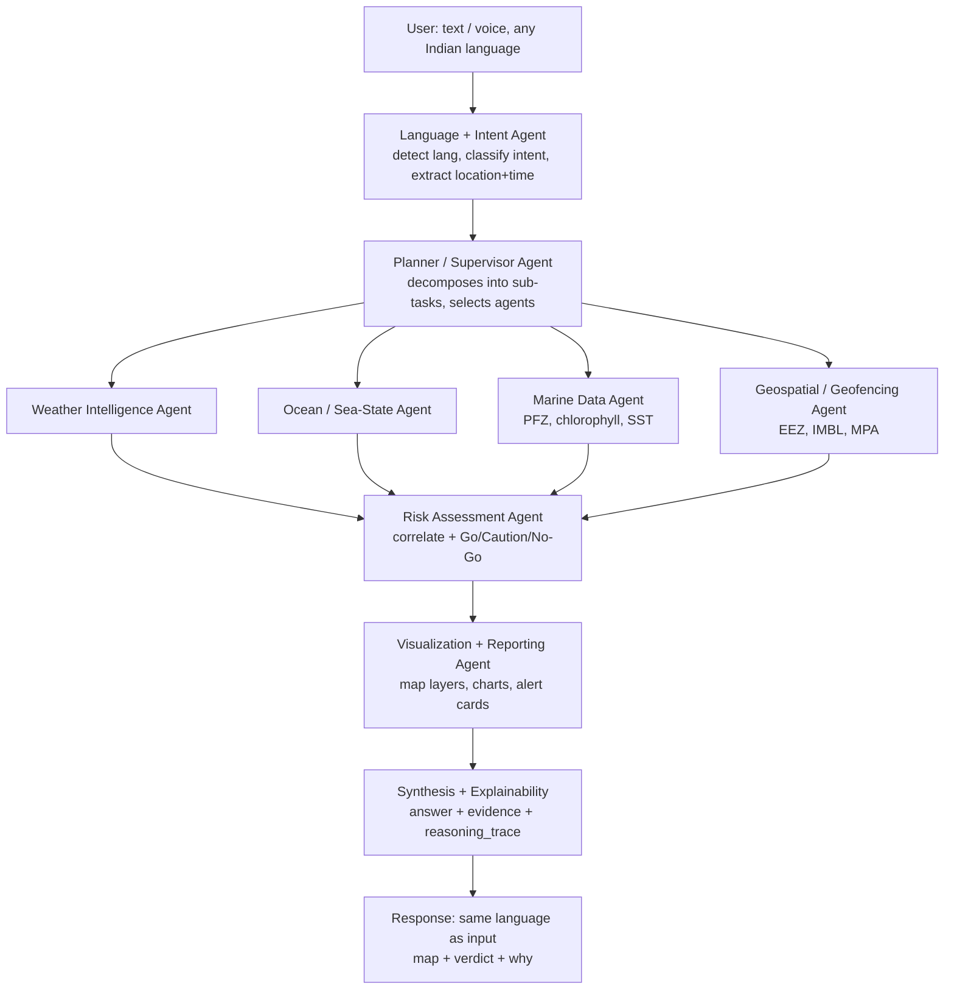

# 🐋 ORCA

**Marine EcOsystem Reasoning with Collaborative Agents**

An agentic AI platform for India's coastal users. A fisherman or maritime authority asks a
question in their own language — *"Where's the nearest fishing zone?"*, *"Is it safe to sail
tomorrow?"* — and a **supervisor agent** plans the task, dispatches **specialist agents** to
fetch marine, weather and geospatial data, correlates the signals, and returns a **map + a
verdict + the evidence and reasoning behind it**.

> **Status: scaffold.** This repo currently contains the architecture, the frozen API
> contract, and stub modules. Nothing runs end-to-end yet. See [docs/ROADMAP.md](docs/ROADMAP.md).

---

## The three things that make ORCA different

1. **Visible reasoning.** Every answer streams its agent trace live — you watch the platform
   think. See [`ReasoningTrace.tsx`](frontend/src/components/ReasoningTrace.tsx).
2. **Evidence, not assertions.** Every answer carries an `evidence[]` array with value,
   source and timestamp. Baked into the schema, not bolted on. See [docs/API_CONTRACT.md](docs/API_CONTRACT.md).
3. **Speaks the user's language.** Query in Tamil, get the answer in Tamil — via Bhashini,
   the Government of India's own Indic language stack.

## Golden path — the four queries that must be flawless

| # | Query | Output |
|---|-------|--------|
| 1 | "Where is the nearest Potential Fishing Zone today?" | Map with PFZ polygons + distance & bearing |
| 2 | "Is it safe to go to sea tomorrow morning near Kakinada?" | **Go / Caution / No-Go** card with reasons |
| 3 | "Am I approaching any restricted boundary?" | Proximity alert vs IMBL / EEZ / MPA |
| 4 | "Why has fish productivity declined in this region?" | Explainable narrative + chlorophyll trend chart |

Plus one multi-turn beat — *"…and is it safe there?"* after #1 — to prove conversational memory.
Route optimisation (#5) is a stretch goal. Full detail in [docs/DEMO_SCRIPT.md](docs/DEMO_SCRIPT.md).

## Architecture



Deeper treatment — including which modules are real LLM agents and which are deterministic
tools — in [docs/ARCHITECTURE.md](docs/ARCHITECTURE.md).

## Repo map

```
Orca/
├── docs/          Architecture, data sources, API contract, roadmap, demo script
├── backend/       FastAPI + LangGraph supervisor and specialist agents
│   └── app/
│       ├── api/         HTTP routes + WebSocket trace stream
│       ├── schemas/     ⭐ FROZEN response contract — code against this
│       ├── graph/       LangGraph state + supervisor topology
│       ├── agents/      The nine specialist modules
│       ├── adapters/    One thin client per data source
│       ├── services/    Cache, risk rules, PFZ proxy, explainability, LLM
│       ├── i18n/        Bhashini / Sarvam
│       └── rag/         ChromaDB advisory + rule retrieval
├── frontend/      React + Vite + Leaflet — chat, map, verdict card, reasoning trace
├── data/          GeoJSON boundaries, Copernicus subsets, cache, demo mocks (gitignored)
└── scripts/       One-shot P0 data-access spikes
```

## Quickstart

> ⚠️ **Not yet runnable.** Dependencies are declared but not installed, and every agent,
> adapter and route is a stub raising `NotImplementedError`. These are the commands that
> will work once P1 lands.

```bash
cp .env.example .env          # then fill in your keys

# Backend
python3 -m venv .venv && source .venv/bin/activate
pip install -r backend/requirements.txt
uvicorn app.main:app --reload --app-dir backend    # → http://localhost:8000/docs

# Frontend
cd frontend && npm install && npm run dev          # → http://localhost:5173
```

## Documentation

| Doc | Read it when |
|-----|--------------|
| [IMPLEMENTATION_REPORT.md](docs/IMPLEMENTATION_REPORT.md) | You want the full strategy — the canonical source of truth |
| [ARCHITECTURE.md](docs/ARCHITECTURE.md) | You're writing an agent or wiring the graph |
| [DATA_SOURCES.md](docs/DATA_SOURCES.md) | You're writing an adapter |
| [API_CONTRACT.md](docs/API_CONTRACT.md) | **Always.** Frontend and backend both code against this |
| [ROADMAP.md](docs/ROADMAP.md) | Start of every phase |
| [TEAM.md](docs/TEAM.md) | You're not sure whose file you're about to edit |
| [DEMO_SCRIPT.md](docs/DEMO_SCRIPT.md) | Rehearsal week |
| [CONTRIBUTING.md](docs/CONTRIBUTING.md) | Before your first PR |

## Timeline

**22 Aug → 10 Sept 2026.** Five phases, each ending in a runnable demo — never let
integration slip to the final week. See [docs/ROADMAP.md](docs/ROADMAP.md).

---

### Data attribution

ORCA is built on open data and credits it:

- Weather and marine forecasts by [Open-Meteo.com](https://open-meteo.com/), licensed
  [CC BY 4.0](https://creativecommons.org/licenses/by/4.0/).
- Ocean colour and sea-surface-temperature products generated by the
  [E.U. Copernicus Marine Service Information](https://marine.copernicus.eu/).
- Potential Fishing Zone advisories from [INCOIS](https://incois.gov.in/), Ministry of Earth
  Sciences, Government of India.
- Maritime boundaries from [Marine Regions](https://www.marineregions.org/); protected areas
  from [Protected Planet (WDPA)](https://www.protectedplanet.net/).
