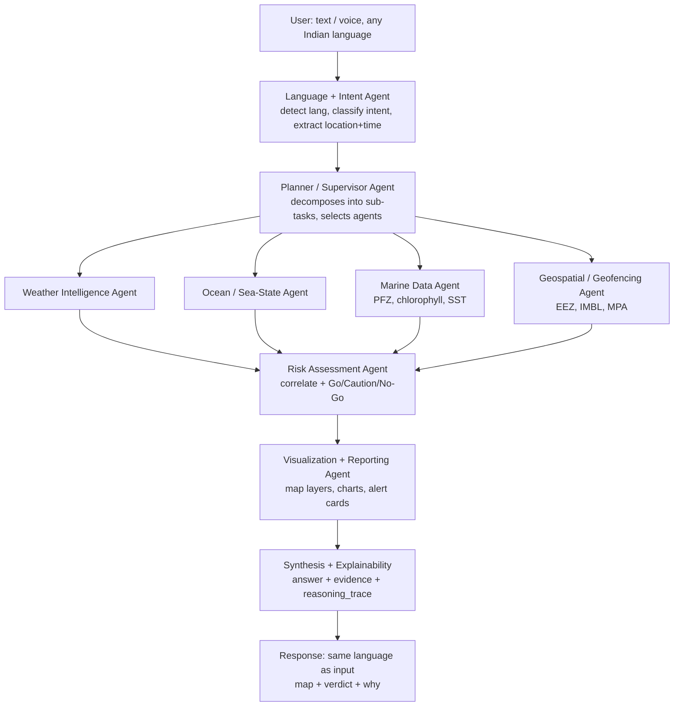

# 🐋 ORCA

**Marine EcOsystem Reasoning with Collaborative Agents**

An agentic AI platform for India's coastal users. A fisherman or maritime authority asks a
question in their own language — *"Where's the nearest fishing zone?"*, *"Is it safe to sail
tomorrow?"* — and a **supervisor agent** plans the task, dispatches **specialist agents** to
fetch marine, weather and geospatial data, correlates the signals, and returns a **map + a
verdict + the evidence and reasoning behind it**.

> **Status: demo-ready.** All five golden queries answer end-to-end on real data, in five
> languages, with a live agent trace, dark mode, voice in and out, and an offline demo mode.
> P4 adds the parts a platform needs beyond answering questions: a live conditions
> dashboard, the next safe departure window, proactive safety watches, tides, thermal-front
> detection and a cyclone classifier — and a rebuilt console interface.
> See [docs/ROADMAP.md](docs/ROADMAP.md) and [docs/DEMO_SCRIPT.md](docs/DEMO_SCRIPT.md).
>
> **It runs with no API keys at all.** Every agent has a deterministic fallback, so
> language detection, intent classification, planning and the verdict all work keyless.
> Adding a Gemini or Groq key upgrades phrasing and lets ORCA answer in the user's language.

---

## The four things that make ORCA different

1. **Visible reasoning.** Every answer streams its agent trace live — you watch the platform
   think. See [`ReasoningTrace.tsx`](frontend/src/components/insight/ReasoningTrace.tsx).
2. **Evidence, not assertions.** Every answer carries an `evidence[]` array with value,
   source and timestamp. Baked into the schema, not bolted on. See [docs/API_CONTRACT.md](docs/API_CONTRACT.md).
3. **Speaks the user's language.** Query in Tamil, get the answer in Tamil — via Bhashini,
   the Government of India's own Indic language stack.
4. **It speaks first.** A conditions dashboard that is already true before you type
   anything, the next safe departure window when the answer is no, and a standing watch
   that warns you when conditions turn. See
   [`services/watch.py`](backend/app/services/watch.py).

And one thing it refuses to do: overclaim. The fishing zones are **computed**, the lightning
risk is **modelled**, the cyclone reading is a **classification of a model field**, and the
tide is **not a port table** — each says so in its own evidence source, and the Sources view
repeats all four in plain language.

## Golden path — the queries that must be flawless

| # | Query | Output |
|---|-------|--------|
| 1 | "Where is the nearest Potential Fishing Zone today?" | Map with PFZ polygons + distance & bearing |
| 2 | "Is it safe to go to sea tomorrow morning near Kakinada?" | **Go / Caution / No-Go** card with reasons |
| 3 | "Am I approaching any restricted boundary?" | Proximity alert vs IMBL / EEZ / MPA |
| 4 | "Why has fish productivity declined in this region?" | Explainable narrative + chlorophyll trend chart |
| 5 | "Plan a route from Kakinada to Chennai" | Least-risk path drawn on the map, costed at time of arrival |

Plus one multi-turn beat — *"…and is it safe there?"* after #1 — to prove conversational
memory, and **voice**: ask by mic in your own language and hear the verdict read back.
Full detail in [docs/DEMO_SCRIPT.md](docs/DEMO_SCRIPT.md).

Beyond the golden path, the console answers without being asked:

| Surface | What it shows |
|---------|---------------|
| **Conditions** | Eight live readings against their small-craft limits, the verdict, the tide, the 48-hour curves — for the chosen harbour, with no question typed |
| **Alerts** | A standing watch that re-checks conditions and boundary distance on a timer and pushes what turned worse |
| **Layers** | Every layer ORCA can draw, what it means and where it came from — fishing zones, thermal fronts, EEZ, IMBL, MPAs, wave field, chlorophyll, SST, hazard cells |
| **Sources** | Every value behind the current answer, and a plain-language list of what is computed rather than issued |

## Architecture



Deeper treatment — including which modules are real LLM agents and which are deterministic
tools — in [docs/ARCHITECTURE.md](docs/ARCHITECTURE.md).

## Repo map

```
Orca/
├── docs/          Architecture, data sources, API contract, roadmap, demo script
├── backend/       FastAPI + LangGraph supervisor and specialist agents
│   └── app/
│       ├── api/         HTTP routes + WebSocket trace stream
│       ├── schemas/     ⭐ FROZEN response contract — code against this
│       ├── graph/       LangGraph state + supervisor topology
│       ├── agents/      The nine specialist modules
│       ├── adapters/    One thin client per data source
│       ├── services/    Cache, risk rules, PFZ proxy, explainability, LLM
│       ├── i18n/        Bhashini / Sarvam
│       └── rag/         ChromaDB advisory + rule retrieval
├── frontend/      React + Vite + Leaflet — a five-view console around a persistent map
│   └── src/
│       ├── components/  shell · conversation · conditions · alerts · map · insight
│       ├── hooks/       one socket, many listeners; profile, conditions, watch, voice
│       └── types/       ⭐ the TS mirror of the response contract
├── data/          GeoJSON boundaries, Copernicus subsets, cache, demo mocks (gitignored)
└── scripts/       One-shot P0 data-access spikes
```

## Quickstart

```bash
cp .env.example .env          # keys are optional — see below

# Backend
python3 -m venv .venv && source .venv/bin/activate
pip install -r backend/requirements.txt
uvicorn app.main:app --reload --app-dir backend    # → http://localhost:8000/docs

# Frontend (in a second terminal)
cd frontend && npm install && npm run dev          # → http://localhost:5173
```

Then ask *"Is it safe to go to sea tomorrow morning near Kakinada?"*

**`GET /ready` tells you what's wired up** — which data sources loaded, whether an LLM key
is live, and what command fixes anything missing. Check it before demoing.

```bash
# The P0 spikes still work standalone, straight against the live APIs:
python -m app.adapters.open_meteo_marine     # real wave height for Kakinada
python -m app.adapters.open_meteo_weather    # real wind + CAPE
python -m app.adapters.open_meteo_geocoding  # Kakinada → 16.99, 82.24
python -m app.adapters.imd_bulletins         # cyclone classification for three ports
pytest backend/tests/                        # 211 tests, no network required
```

## Getting the data

Nothing below blocks you from running ORCA — each one unlocks a specific capability, and
until it lands the responsible agent emits a visible `skipped` step naming the fix.

| What | Unlocks | How |
|------|---------|-----|
| **Gemini key** (free) | Answers in the user's language, better edge-case classification | [aistudio.google.com/apikey](https://aistudio.google.com/apikey) → `GEMINI_API_KEY` in `.env` |
| **Groq key** (free) | Fallback when Gemini rate-limits | [console.groq.com](https://console.groq.com) → API Keys → Create → `GROQ_API_KEY` |
| **Copernicus account** (free) | Golden query #1 — the computed PFZ proxy, and thermal-front detection | [register](https://data.marine.copernicus.eu/register), then `copernicusmarine login` and `python scripts/fetch_copernicus_subset.py` |
| **EEZ / IMBL polygons** | Golden query #3 — geofencing | `python scripts/download_geojson.py` — fetches both automatically from Marine Regions' public WFS, no form needed |
| **MPA polygons** (optional) | Protected-area breach alerts | [Protected Planet](https://www.protectedplanet.net/country/IND) → accept terms → drop the zip in `data/geojson/raw/` and re-run the script |
| **Knowledge base** (optional) | Answers to general marine questions | `python -m app.rag.ingest` — first run downloads a small embedding model |
| **Bhashini** (optional) | Government of India NMT, preferred over the LLM for Indic output | [bhashini.gov.in/ulca](https://bhashini.gov.in/ulca) → `BHASHINI_USER_ID` + `BHASHINI_API_KEY` |

> **Model names go stale.** `gemini-2.5-flash` and `llama-3.3-70b-versatile` (the original
> defaults) are both retired for new keys and return 404. Defaults are now
> `gemini-flash-latest` — an alias, so it tracks the current model instead of pinning a
> version that expires — and `openai/gpt-oss-120b` on Groq. Check what a key can reach:
>
> ```bash
> curl "https://generativelanguage.googleapis.com/v1beta/models?key=$GEMINI_API_KEY"
> curl https://api.groq.com/openai/v1/models -H "Authorization: Bearer $GROQ_API_KEY"
> ```
>
> A dead model is not fatal — ORCA falls back to the deterministic path and answers
> correctly in English. Check `/ready` and the trace's `[via …]` tag to tell which ran.


## Documentation

| Doc | Read it when |
|-----|--------------|
| [IMPLEMENTATION_REPORT.md](docs/IMPLEMENTATION_REPORT.md) | You want the full strategy — the canonical source of truth |
| [ARCHITECTURE.md](docs/ARCHITECTURE.md) | You're writing an agent or wiring the graph |
| [DATA_SOURCES.md](docs/DATA_SOURCES.md) | You're writing an adapter |
| [API_CONTRACT.md](docs/API_CONTRACT.md) | **Always.** Frontend and backend both code against this |
| [ROADMAP.md](docs/ROADMAP.md) | Start of every phase |
| [TEAM.md](docs/TEAM.md) | You're not sure whose file you're about to edit |
| [DEMO_SCRIPT.md](docs/DEMO_SCRIPT.md) | Rehearsal week |
| [CONTRIBUTING.md](docs/CONTRIBUTING.md) | Before your first PR |
| [DEPLOYMENT.md](docs/DEPLOYMENT.md) | You're hosting it — **read before importing to Vercel** |

## Timeline

**22 Aug → 10 Sept 2026.** Five phases, each ending in a runnable demo — never let
integration slip to the final week. See [docs/ROADMAP.md](docs/ROADMAP.md).

---

### Data attribution

ORCA is built on open data and credits it:

- Weather and marine forecasts by [Open-Meteo.com](https://open-meteo.com/), licensed
  [CC BY 4.0](https://creativecommons.org/licenses/by/4.0/).
- Ocean colour and sea-surface-temperature products generated by the
  [E.U. Copernicus Marine Service Information](https://marine.copernicus.eu/).
- Potential Fishing Zone advisories from [INCOIS](https://incois.gov.in/), Ministry of Earth
  Sciences, Government of India.
- Maritime boundaries from [Marine Regions](https://www.marineregions.org/); protected areas
  from [Protected Planet (WDPA)](https://www.protectedplanet.net/).
