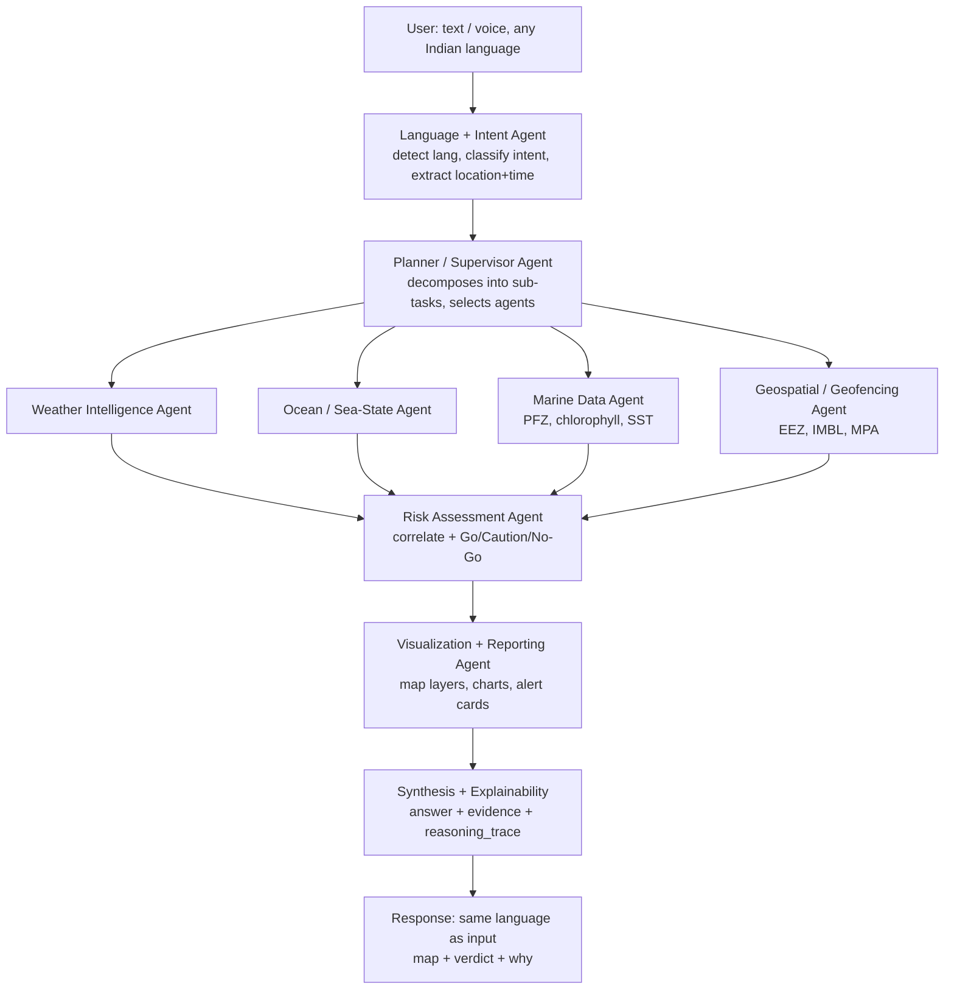

# Architecture

## The pattern

A LangGraph **supervisor**. One planner node decides which specialists to call for a given
intent, the specialists run (in parallel where they don't depend on each other), a risk node
correlates their output, and a synthesis layer attaches evidence and the trace before the
response leaves the building.

Two rules make the whole thing work:

1. **Every node appends to a shared `reasoning_trace`.** Not optional, not "if you have
   time." A node that touches data and doesn't leave a trace step is a bug.
2. **Agents never touch raw HTTP.** They call adapters. This is what lets us swap live INCOIS
   for the Copernicus PFZ proxy — or for a cached mock on demo day — without editing an agent.



## Layers

```
  api/          HTTP + WebSocket boundary. No business logic. Owner: B
    ↓
  graph/        LangGraph topology and shared state. Owner: A
    ↓
  agents/       Reasoning. Decides what to ask for and what it means. Owners: A, E
    ↓
  services/     Shared logic: risk rules, PFZ proxy, cache, LLM, explainability. C, E
    ↓
  adapters/     One thin client per external source. The only place HTTP lives. Owner: B
    ↓
  data/         GeoJSON boundaries, Copernicus NetCDF subsets, cache, demo mocks
```

Dependencies point **downward only**. An adapter that imports an agent is a bug; so is an
agent that imports another agent (route it through the graph instead).

## Which modules are real LLM agents

Five LLM calls, not ten. The rest are deterministic tools the supervisor invokes — faster,
cheaper, testable, and impossible to hallucinate.

| Module | Type | Job |
|--------|------|-----|
| `agents/language_intent.py` | **LLM** | Detect language, classify intent, extract location + time window |
| `agents/planner.py` | **LLM** | Decompose the request, choose and sequence specialists |
| `agents/weather.py` | Tool + light LLM | Wind, rain, thunderstorm probability, IMD cyclone bulletins |
| `agents/sea_state.py` | Tool | Wave height, swell, period, currents, tides |
| `agents/marine_data.py` | Tool + **LLM** | PFZ location; chlorophyll + SST fronts; trend narrative |
| `agents/geospatial.py` | Tool (shapely) | Point-in-polygon vs EEZ / IMBL / MPA; distance to boundary |
| `agents/risk.py` | Rules + **LLM** | Correlate signals → GO / CAUTION / NO_GO with stated reasons |
| `agents/route.py` | Tool (A*) | Least-risk path over the sea-state grid *(stretch)* |
| `agents/visualization.py` | Tool | Build GeoJSON layers, chart specs, alert cards |
| `services/explainability.py` | Layer | Assemble `evidence[]` + `reasoning_trace[]` onto every answer |

**Risk deserves a note.** The verdict itself is *deterministic* — `services/risk_rules.py`
compares values against thresholds and returns the verdict plus which rule fired. The LLM
only phrases the reasons in the user's language. Never let the model decide whether it's safe
to go to sea; a hallucinated GO is the worst possible failure of this project.

## Shared state

`graph/state.py` holds `OrcaState`, threaded through every node:

```
query, session_id, language, intent, location, time_window
plan                 ← what the planner decided
weather, sea_state, marine, geofence   ← specialist outputs
verdict, alerts
evidence[]           ← append-only, accumulated across nodes
reasoning_trace[]    ← append-only, accumulated across nodes
answer, map_layers, charts
```

`evidence` and `reasoning_trace` use LangGraph **append reducers** so parallel specialists can
write concurrently without clobbering each other. Everything else is last-write-wins.

## How a query flows

Taking golden query #2, *"Is it safe to sail tomorrow near Kakinada?"*:

1. `POST /api/query` → `routes_query.py` validates a `QueryRequest`, generates the run.
2. Frontend already holds a WebSocket on `/ws/trace/{session_id}`.
3. `language_intent` → `lang=te`, `intent=safety_check`, geocode Kakinada → 16.99, 82.24.
   *Emits trace step 0.*
4. `planner` → `[weather, sea_state, risk]`. *Emits step 1.*
5. `weather` and `sea_state` run **in parallel**, each calling its adapter, each appending
   evidence and a trace step.
6. `risk` reads the accumulated evidence, runs `risk_rules.evaluate()`, gets
   `NO_GO` + `"wave_height 3.4 m > 2.5 m small-craft threshold"`.
7. `visualization` picks layers `[user_pin, wave_heatmap]` and a 48-hour wave chart.
8. `explainability` assembles the final `OrcaResponse`; the LLM writes `answer` in Telugu.
9. Response returns on the POST **and** as a `type: "answer"` WebSocket frame.

Multi-turn — *"…and is it safe there?"* — works because `session_id` keys the graph
checkpointer, so the PFZ location from the previous turn is still in state.

## The two paths that do not start with a question (P4)

Everything above describes a *conversational turn*: text in, graph run, answer out. Two
later additions deliberately bypass the graph, and the reason is worth stating because
"why isn't this an agent?" is the obvious question.

```
  GET /api/conditions ──► services/conditions.py ──┬─► adapters (marine, weather)
                                                   ├─► services/risk_rules  (the verdict)
                                                   └─► services/safe_window (when next)

  POST /api/watch ──────► services/watch.py ───────► services/conditions (on a timer)
                                    │
                                    └─► api/ws_trace.emit_watch_alert ──► the same socket
```

Neither runs a planner and neither makes a choice. The conditions snapshot is a fixed
bundle of the adapters the specialists already use, reduced through the same threshold
module; routing it through the graph would add a language-detection round trip and a
fan-out decision to a request that has no language and no decision.

**What makes this safe is that the verdict is not reimplemented.** `conditions.py` calls
`agents.risk.assess`, which calls `risk_rules.evaluate` — byte for byte the function the
safety agent uses. A dashboard that disagreed with the chat answer would be worse than no
dashboard, and sharing the function is what makes that impossible rather than unlikely.
`test_conditions.py::test_the_verdict_matches_the_shared_risk_rules` pins it.

A watch is that same snapshot on an `asyncio` timer, with a set of already-announced
fingerprints so a persisting hazard is reported once rather than every cycle. Watches are
in-process and do not survive a restart — and the interface says so, rather than implying a
durability the deployment does not have.

## Failure behaviour

A specialist that fails does **not** fail the run. It appends a `skipped` trace step with
the reason, contributes no evidence, and the graph continues. The user gets a partial answer
that says what's missing. See the degradation rule in [API_CONTRACT.md](API_CONTRACT.md).

Cascade for every adapter: **live → cache → mock**. `ORCA_USE_MOCK_DATA=true` forces the
last rung for demo day.

## Module ownership

| Path | Owner |
|------|-------|
| `backend/app/graph/`, `backend/app/agents/{planner,language_intent}.py` | **A** |
| `backend/app/api/`, `backend/app/adapters/`, `backend/app/services/cache.py` | **B** |
| `backend/app/schemas/`, `backend/app/services/explainability.py`, `backend/app/rag/` | **C** |
| `frontend/` | **D** |
| `backend/app/services/{risk_rules,pfz_proxy,safe_window,fronts}.py`, `agents/{geospatial,route,marine_data}.py` | **E** |
| `backend/app/services/{conditions,watch}.py`, `backend/app/api/routes_conditions.py` | **B + E** |
| `backend/app/i18n/`, voice pipeline, mobile view | **F** |

Full role detail in [TEAM.md](TEAM.md).

## Deployment

Frontend on Vercel, backend on Hugging Face Spaces or Render — **but demo from localhost.**
Zero cold-start risk, no conference Wi-Fi dependency. Deploy anyway so the judges have a link.
