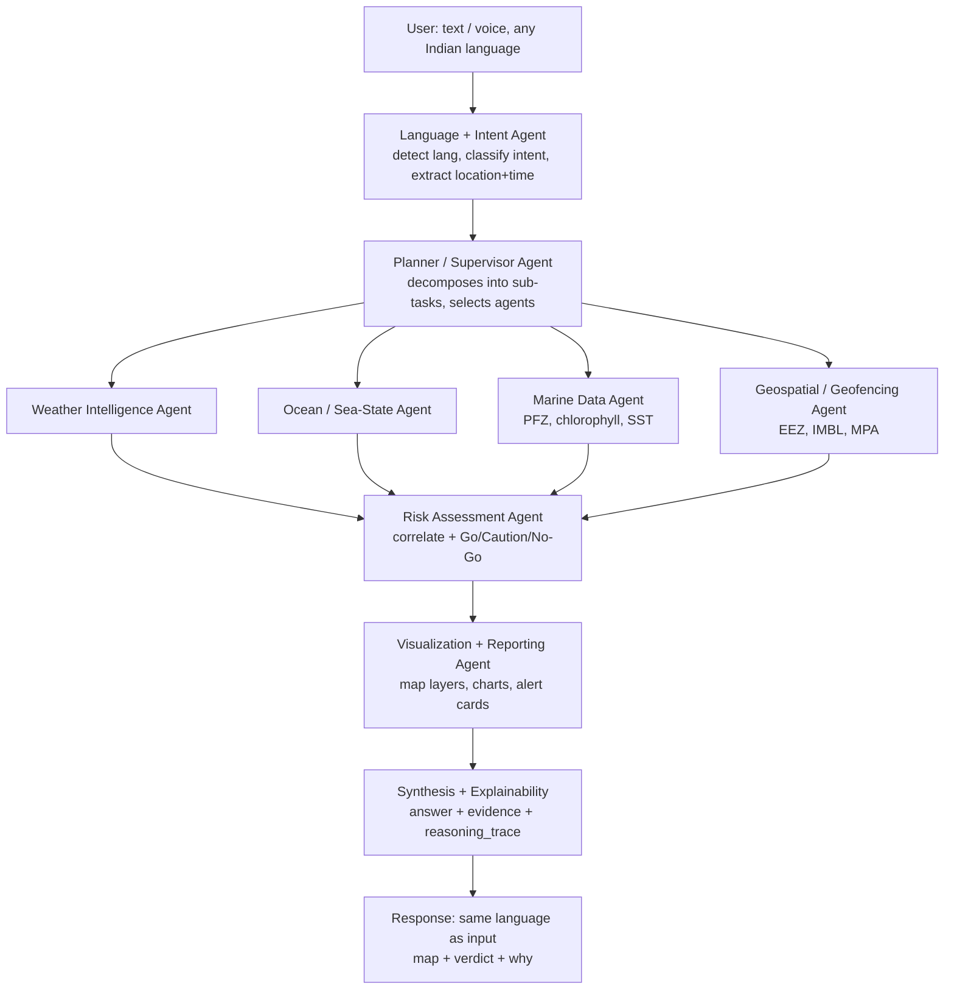

# ORCA — Implementation Report
### Marine EcOsystem Reasoning with Collaborative Agents
**Target ship date:** 10 Sept 2026 · **Window:** ~19 days · **Team:** 6

---

## 1. Quick Summary

- **What we're building:** an Agentic AI platform where a coastal user (fisherman, authority) asks a natural-language question — "Where's the nearest fishing zone?", "Is it safe to sail tomorrow?" — and a **supervisor agent** plans the task, dispatches **specialist agents** to fetch marine/weather/geospatial data, correlates them, and returns a **map + verdict + the evidence and reasoning behind it**.
- **The winning move is NOT "build all 10 capabilities."** It's building **4 killer queries end-to-end**, wrapped in a **visible reasoning trace** and **multilingual (Bhashini)** layer. Depth + explainability beats breadth for SIH judging.
- **Biggest technical risk = data access.** INCOIS has **no clean REST API** (only WebGIS + text pages). De-risk this in the first 48 hours or it kills you on demo day.
- **Recommended core stack:** Python · **FastAPI** backend · **LangGraph** supervisor/multi-agent · **Gemini 2.x Flash** (free tier, strong Indic) · **Open-Meteo Marine** + **Copernicus Marine Toolbox** (both free) · **React + Leaflet** frontend · **Bhashini** for Indian languages.
- **Everything below is buildable on free tiers.** No paid API is required for the prototype.

---

## 2. Key Strategic Insights (Reality Check — read this first)

> Your preference is that I challenge the plan, not just execute it. Here are the calls that decide whether you win.

| # | Insight | What it means for you |
|---|---------|-----------------------|
| 1 | **Scope is a trap.** The PS lists ~10 capabilities. In 19 days you cannot build all *well*. | Pick a **golden path** of 4 demo queries (§6). Everything else is "architected but stubbed." A judge remembers one flawless demo, not ten broken ones. |
| 2 | **"Agentic" must be *visible*.** Judges can't see planning/tool-selection unless you show it. | Build a **Reasoning Trace panel** (§9) that streams "Planner → Weather agent → Sea-state agent → Risk agent → verdict." This is your single biggest differentiator and it's cheap. |
| 3 | **Explainability is the scoring lever.** The PS says "explainable / evidence-based / supporting reasoning" **three times.** | Bake `evidence[]` + `reasoning_trace[]` into your response schema from **day 1** (§12), not as an afterthought. |
| 4 | **Regional-language support is explicitly emphasized** — and it's a govt problem. | Integrate **Bhashini** (India's national language stack). Using the govt's own Indic AI stack on a govt marine problem is a massive signal to SIH judges. |
| 5 | **Don't make 10 real LLM agents.** That's slow, expensive, and fragile. | Use **~5 real agents** for reasoning-heavy steps; implement the rest as **deterministic tools** the supervisor calls. Present it as a 10-module architecture (it is), implement it pragmatically. |
| 6 | **Voice is not required** by the PS ("conversational" ≠ "voice") — but it's your team's edge. | Add **Indic voice I/O** as a *stretch* wow-factor (§8), only after the golden path works. You've shipped voice agents before (Notch AI) — leverage it, don't let it block core. |
| 7 | **Live data will fail during a live demo.** Wi-Fi drops, APIs rate-limit. | Build a **cache + mock fallback** layer. Demo off cached-but-real responses. Never demo on a cold live call. |

**Bottom line:** Narrow the scope, make the reasoning visible, prove every answer with evidence, speak the user's language. That's the whole strategy.

---

## 3. Recommended Architecture

**Pattern:** LangGraph **Supervisor (orchestrator)** → specialist agents/tools → **Synthesis + Explainability** layer. Multi-turn state held in the graph; every node appends to a shared `reasoning_trace`.



**Agent roster (what's a real LLM agent vs a tool):**

| Agent / Module | Type | Job |
|----------------|------|-----|
| Language + Intent | LLM | Detect language, classify intent (PFZ / safety / geofence / diagnostic / route), extract lat-lon + time |
| Planner / Supervisor | LLM | Decompose request, choose which agents to call, sequence them |
| Weather Intelligence | Tool + light LLM | Wind, rain, cyclone/lightning alerts (Open-Meteo + IMD) |
| Ocean / Sea-State | Tool | Wave height, swell, currents, tides (Open-Meteo Marine) |
| Marine Data | Tool + LLM | PFZ location, chlorophyll & SST fronts (INCOIS + Copernicus) |
| Geospatial / Geofencing | Tool (shapely) | Point-in-polygon vs EEZ / IMBL / MPA; distance to boundary |
| Risk Assessment | LLM + rules | Correlate all signals → Go/Caution/No-Go + reasons |
| Route Optimization | Tool (A*/graph) | Least-risk sea path over the sea-state grid *(stretch)* |
| Visualization / Reporting | Tool | Build GeoJSON layers, chart data, alert cards |
| Explainability | Layer | Attach evidence + reasoning trace to every answer |

---

## 4. Tech Stack (recommended, all free-tier)

| Layer | Choice | Why |
|-------|--------|-----|
| **Language** | Python 3.11+ | The whole geospatial + agent ecosystem lives here |
| **Agent framework** | **LangGraph** | Best-in-class for stateful supervisor + multi-agent graphs; free/OSS. (CrewAI = simpler fallback) |
| **LLM** | **Gemini 2.x Flash** (`ai.google.dev`, free tier) | Generous free quota, strong at Indian languages, fast, tool-calling. Groq (Llama) as fast fallback |
| **Backend/API** | **FastAPI + Uvicorn** | Async, WebSocket streaming for live reasoning trace |
| **Frontend** | **React + Vite + TailwindCSS** | Fast to build, skimmable UI |
| **Map** | **Leaflet + react-leaflet** on OpenStreetMap tiles | Free, no key; overlays PFZ/geofence/hazard/route |
| **Geospatial compute** | **shapely + geopandas + pyproj** | Point-in-polygon, distance-to-boundary, front detection |
| **Gridded ocean data** | **copernicusmarine + xarray** | Read SST/chlorophyll NetCDF for reasoning |
| **RAG / knowledge** | **ChromaDB** (local) + Gemini embeddings | Advisory text, geofence rules, marine FAQ |
| **Multilingual** | **Bhashini** (ASR/NMT/TTS) + Sarvam AI fallback | Govt Indic stack — big SIH signal |
| **Cache** | Redis or simple SQLite/JSON | Fallback + demo safety |
| **Deploy** | HF Spaces / Render (backend), Vercel (frontend) — or localhost for demo | Zero cost |

---

## 5. Data Sources (the crown jewel — real, free, verified)

> This is where teams win or die. Build thin **adapters** around each so agents call a clean internal interface, not the raw source.

| Source | Gives you | Access | Notes / gotcha |
|--------|-----------|--------|----------------|
| **Open-Meteo Marine API** | Wave height/period/direction, swell, **SST**, ocean currents | `https://marine-api.open-meteo.com/v1/marine` — **no key**, JSON, 16-day forecast | Your **sea-state backbone.** 10k free calls/day. CC-BY attribution required |
| **Open-Meteo Weather API** | Wind, precip, temp, weather codes, thunderstorm probability | `https://api.open-meteo.com/v1/forecast` — no key | Wind + rain + storm-proxy for safety verdict |
| **Open-Meteo Geocoding** | Place name → lat/lon | `https://geocoding-api.open-meteo.com/v1/search` | Resolve "near Vizag" to coordinates |
| **Copernicus Marine Toolbox** | Gridded **chlorophyll-a** + **SST** (+ physics) | `pip install copernicusmarine`; **free account**; Python API, NetCDF/Zarr, no quotas | Lets ORCA **reason about** PFZ (SST fronts + high chlorophyll), not just echo INCOIS. Datasets: OSTIA SST `SST_GLO_SST_L4_NRT_OBSERVATIONS_010_001`, Biogeochemistry `GLOBAL_ANALYSISFORECAST_BGC_001_028`. Pre-download a **Bay-of-Bengal + Arabian-Sea subset** — don't stream NetCDF live |
| **INCOIS PFZ Advisory** | Official Potential Fishing Zones (14 coastal sectors, ~1223 nodes) | `incois.gov.in/MarineFisheries/PfzAdvisory`, `/TextDataHome`, geoportal `geoportal/MFASPFZ` | ⚠️ **No clean REST API.** Parse the **text advisory pages** + WebGIS layers. Cache daily. This is your #1 data risk |
| **INCOIS Ocean State Forecast / Marine Heat Wave** | Sea-state forecast, MHW advisories | INCOIS portal pages | Supplements safety + "why productivity declined" |
| **IMD / RSMC cyclone bulletins** | Cyclone + severe-weather alerts | IMD public bulletins (`mausam.imd.gov.in`, RSMC) | Cyclone/lightning are hard to get cleanly → use IMD bulletins + Open-Meteo storm probability as proxy. **Flag this honestly in the demo** |
| **Marine Regions — EEZ** | India EEZ + maritime boundary polygons (GeoJSON) | `marineregions.org` (EEZ v11/v12 download) | Geofencing: distance to **International Maritime Boundary Line** |
| **Protected Planet (WDPA)** | Marine Protected Areas polygons | `protectedplanet.net` | Geofencing: "avoid this zone" alerts |

**PFZ reasoning fallback (important):** if you can't reliably parse live INCOIS, **compute a PFZ proxy yourself** from Copernicus: high chlorophyll (>~0.2–0.3 mg/m³) + strong SST gradient (fronts) = likely aggregation zone. This is scientifically the actual INCOIS method and makes your "reasoning" real, not scraped.

---

## 6. Core Features & Golden-Path Demo (build in this priority order)

Each query is chosen to exercise a different Agentic principle. **Get #1–#4 flawless; #5 is stretch.**

| Priority | Demo query | Agents exercised | Output |
|----------|-----------|------------------|--------|
| **1** | "Where is the nearest Potential Fishing Zone today?" | Language → Planner → Marine Data → Geospatial | Map with PFZ polygons, nearest zone, **distance + bearing** from user |
| **2** | "Is it safe to go to sea tomorrow morning near [place]?" | Planner → Weather + Sea-state → **Risk** | **Go / Caution / No-Go** card with the reasons (wave 3.4 m > 2 m limit → No-Go) |
| **3** | "Am I approaching any restricted boundary?" | Planner → Geospatial/Geofencing | Proximity alert vs IMBL/EEZ/MPA on map + warning banner |
| **4** | "Why has fish productivity declined in this coastal region?" | Planner → Marine Data (chlorophyll+SST trend) → Risk/Synthesis | **Explainable narrative** with a chlorophyll-over-time chart — showcases *reasoning depth* |
| **5** *(stretch)* | "Safest route from A to B" | Route Optimization over sea-state grid | Least-risk path drawn on map |

**Multi-turn to show off:** "…and is it safe there?" after query 1 → context carries the PFZ location into query 2. This single follow-up proves conversational memory to judges.

---

## 7. Interface / UX Spec (what the screen must have)

**Layout: split view — chat left, map right, trace bottom.**

- **Conversational chat panel** — multi-turn, streaming responses, language auto-detected; mic button for voice.
- **Interactive map (Leaflet)** — the hero. Layers with toggles:
  - PFZ zones · User location pin · **Geofence boundaries** (EEZ / IMBL / MPA) · Hazard overlay · Route line
  - Heatmap toggles: **SST**, **Chlorophyll**, **Wave height**
- **Safety Verdict card** — big **Go / Caution / No-Go** badge + top 2–3 reasons + validity time.
- **Alert banner** — cyclone / high-wave / lightning / geofence, color-coded, dismissible.
- **Reasoning Trace panel** (§9) — collapsible "How I decided this," streaming agent steps + sources. **This is what makes it look agentic.**
- **Forecast charts** — 48-hr wave + wind; tide curve.
- **Source citations** — every answer footnotes its data source + timestamp.
- **Language + voice controls** — language picker, voice in/out toggle.

**Design note:** keep it clean and mobile-legible (the real user is a fisherman on a phone). One glanceable verdict beats a wall of numbers.

---

## 8. Multilingual & Voice Layer

Requirement: *detect the query's language and respond in the same, emphasis on Indian regional languages.*

- **Text (do this):** Gemini Flash handles most Indic languages natively → detect + respond in-language directly. Add **Bhashini NMT** for translation-quality guarantees on Tamil / Telugu / Malayalam / Bengali / Hindi (the coastal languages).
- **Voice (stretch):** **Bhashini ASR** (speech→text) + **Bhashini TTS** (text→speech), or **Sarvam AI** as fallback. Pipeline: mic → ASR → agent graph → response → TTS.
- **Why Bhashini specifically:** it's the Government of India's national language mission. Using it on a government marine problem statement is a strong, deliberate SIH signal — call it out in your deck.

Keep voice **behind** the golden path. Ship text-multilingual first.

---

## 9. Explainability & Evidence (your scoring lever — do NOT skip)

The PS demands explainable, evidence-based answers. Make it structural:

- Every agent that touches data **appends to a shared `reasoning_trace[]`** ("Sea-state agent: fetched Open-Meteo, wave_height=3.4m at 06:00").
- Every answer carries an **`evidence[]`** array: `{value, source, timestamp, location}`.
- The **Reasoning Trace panel** streams these live via WebSocket as agents fire — the user literally watches the platform think.
- The **Risk verdict** always states the rule that fired: *"No-Go: forecast wave height 3.4 m exceeds the 2.5 m small-craft threshold at your location tomorrow 06:00 (source: Open-Meteo Marine, ICON-Wave)."*

This turns "trust me" into "here's exactly why" — which is the entire point of the problem statement.

---

## 10. 19-Day Roadmap (22 Aug → 10 Sept)

| Phase | Dates | Goal | Key deliverables |
|-------|-------|------|------------------|
| **P0 — De-risk & Setup** | Aug 22–24 (Sat–Mon) | Prove data access, lock architecture | Repo + FastAPI skeleton + LangGraph "hello agent"; **working adapters for Open-Meteo (both) + Copernicus**; INCOIS parse spike (go/no-go decision on scraping vs proxy); roles assigned |
| **P1 — Golden Query #1 end-to-end** | Aug 25–31 | One full vertical slice works | Language+Intent agent, Planner, Marine Data + Geospatial agents; **"nearest PFZ" query returns a real map**; response schema (`answer/evidence/trace`) frozen; basic chat + Leaflet UI |
| **P2 — Queries #2–#4 + layers** | Sep 1–6 | Golden path complete + multilingual | Weather + Sea-state + Risk agents → **safety verdict**; **geofencing** vs EEZ/IMBL/MPA; "why declined" reasoning; SST/chlorophyll/wave map layers; **Bhashini text** integration; **Reasoning Trace panel** live |
| **P3 — Polish & harden** | Sep 7–9 | Demo-proof | **Cache + mock fallback**; alert banners; charts; source citations; UI polish; **demo script + deck**; stretch (voice / route) *if* core is solid |
| **P4 — Buffer + rehearsal** | Sep 10 | Ship | End-to-end rehearsal x3, fix demo-breakers only, submit |

**Rule:** at the end of **every** phase you must have a *runnable demo*, even if thin. Never let integration slip to the last week.

---

## 11. Team Role Split (6 people)

| Person | Skill | Owns |
|--------|-------|------|
| **You (A)** | Agentic AI | LangGraph supervisor, agent design, orchestration, planner logic, overall integration |
| **B** | Backend / Data | FastAPI, **data adapters** (Open-Meteo, Copernicus, INCOIS parser), caching/fallback, WebSocket |
| **C** | RAG | ChromaDB, advisory/geofence-rule RAG, **explainability layer**, response schema |
| **D** | Web | React + Leaflet UI, chat, **Reasoning Trace panel**, alert cards, charts |
| **E** | ML / Geospatial | PFZ-proxy reasoning (chlorophyll+SST fronts), geofencing (shapely), risk model, route opt |
| **F** | Multilingual + App + CV | Bhashini/Sarvam integration, voice pipeline, mobile view; **CV stretch:** front/eddy detection from SST imagery |

Daily 15-min standup. Integrate on `main` continuously — the #1 hackathon killer is "everyone integrates on day 18."

---

## 12. Response Schema / Data Contract (freeze this on Day 3)

Every agent graph run returns:

```json
{
  "query": "Is it safe to sail tomorrow near Kakinada?",
  "language": "te",
  "intent": "safety_check",
  "location": {"lat": 16.99, "lon": 82.24, "name": "Kakinada"},
  "answer": "No-Go tomorrow morning: seas too rough.",
  "verdict": "NO_GO",
  "evidence": [
    {"field": "wave_height", "value": 3.4, "unit": "m",
     "source": "Open-Meteo Marine (ICON-Wave)", "time": "2026-09-02T06:00Z"},
    {"field": "wind_speed", "value": 42, "unit": "km/h",
     "source": "Open-Meteo", "time": "2026-09-02T06:00Z"}
  ],
  "reasoning_trace": [
    "Intent=safety_check, lang=te, resolved Kakinada→16.99,82.24",
    "Planner → [Weather, Sea-state, Risk]",
    "Sea-state: wave_height 3.4m > 2.5m small-craft threshold",
    "Risk: threshold breached → NO_GO"
  ],
  "map_layers": ["user_pin", "wave_heatmap", "eez_boundary"],
  "alerts": ["HIGH_WAVE"]
}
```

If this contract is stable early, frontend and backend build in parallel without blocking each other.

---

## 13. Free Deployment

- **Frontend:** Vercel or Netlify (free).
- **Backend:** Hugging Face Spaces (Docker) or Render free tier. **Or just run localhost for the live demo** — most reliable, zero cold-start risk.
- **Copernicus data:** pre-download the Indian-Ocean subset into the repo/cache so you're never blocked on a live NetCDF pull.
- **Secrets:** Gemini + Bhashini keys in env vars, never committed.

---

## 14. Common Mistakes to Avoid

- ❌ **Building all 10 capabilities.** → Golden path of 4. Depth wins.
- ❌ **Real-time INCOIS scraping as a hard dependency.** → Cache daily + PFZ proxy from Copernicus as backup.
- ❌ **Making explainability a last-week feature.** → It's in the schema from day 3.
- ❌ **10 separate LLM agents.** → 5 LLM agents + deterministic tools. Latency and cost will bite you otherwise.
- ❌ **Integrating on day 18.** → Continuous integration on `main`, runnable demo every phase.
- ❌ **Demoing on a cold live API over conference Wi-Fi.** → Cached-but-real fallback path.
- ❌ **Ignoring the language requirement** because "English is easier." → It's explicitly weighted; Bhashini is your friend.
- ❌ **A pretty chatbot with no map.** → The map + visible reasoning are what make it *this* project and not a generic RAG bot.

---

## 15. Stretch Differentiators (only after golden path is solid)

- **Indic voice I/O** (your team's edge — Notch AI experience).
- **CV front/eddy detection** from SST imagery feeding the PFZ agent (uses your CV person meaningfully).
- **Proactive push alerts** ("cyclone forming near your usual zone").
- **Route optimization** as least-risk weather routing.
- **SARAT-style** search-and-rescue "last known position" reasoning (nods to real INCOIS services — judges will notice).

---

## 16. Day-1 Action Checklist (start today)

- [ ] Create the GitHub repo + FastAPI skeleton + LangGraph "hello agent."
- [ ] Register a **free Copernicus Marine account**; run one `copernicusmarine.subset` for a Bay-of-Bengal SST + chlorophyll slice.
- [ ] Hit **Open-Meteo Marine + Weather** for one coastal lat/lon; confirm JSON.
- [ ] Register **Gemini API** free key; confirm a Telugu/Tamil round-trip.
- [ ] **INCOIS parse spike** (½ day, person B+E): can we reliably read the PFZ text page? Decide scrape vs proxy by end of Day 2.
- [ ] Download **India EEZ GeoJSON** (Marine Regions); load into shapely; test point-in-polygon.
- [ ] Assign the 6 roles (§11) and set the daily standup time.
- [ ] Freeze the **response schema** (§12) — everyone codes against it.

---

*Attribution reminder: Open-Meteo (CC-BY 4.0) and Copernicus Marine both require data credit — add it to your footer and deck; it reads as professionalism to judges.*
